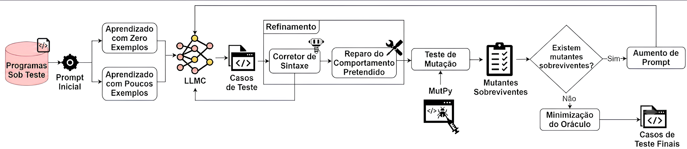

# MuTAP Demo — Geração de Testes com LLMs e Teste de Mutação

Implementação didática do pipeline **MuTAP (Mutation Test case generation using Augmented Prompt)**, proposto no artigo *["Effective Test Generation Using Pre-trained Large Language Models and Mutation Testing"](https://arxiv.org/abs/2308.16557) (arXiv:2308.16557)* (Dakhel et al., 2023).

## Objetivo

Demonstrar como **Large Language Models (LLMs)** podem gerar testes unitários automatizados e como o **Teste de Mutação** pode ser usado como mecanismo de feedback para melhorar iterativamente a eficácia desses testes na detecção de bugs.

O projeto implementa um loop iterativo onde:

1. Um LLM gera um teste inicial para uma função (PUT — Program Under Test)
2. O MutPy cria mutantes (versões com bugs sintéticos) da função
3. Os testes são executados contra os mutantes → calcula-se o **Mutation Score (MS)**
4. Mutantes que **sobrevivem** aos testes revelam limitações no conjunto de testes
5. O prompt é **aumentado** com o mutante sobrevivente + instrução
6. O LLM gera um **novo teste** direcionado para matar aquele mutante
7. Repete-se até MS = 100% ou não haver mais mutantes inexplorados




## Stack

| Camada | Tecnologia | Função |
|---|---|---|
| **LLM** | **Gemini API** (padrão) | Geração de testes via API Google (gratuito, 60 req/min) |
| | **Ollama + CodeLlama** (alternativa) | LLM local, sem dependência externa |
| **Mutação** | **MutPy** | Gera mutantes (bugs sintéticos) do código testado |
| **Testes** | **Pytest** | Executa os testes unitários gerados |
| **Linguagem** | **Python 3.10+** | — |

### LLMs suportados

O experimento foi desenhado para funcionar com 2 opções de LLM para escolha:

- **Gemini (padrão):** Rápido, via API, gratuito. Recomendado para desenvolvimento.
- **Ollama + CodeLlama (alternativa):** Roda localmente, sem necessidade de internet ou chave de API. Útil para comparar resultados entre modelos.

A escolha é feita pelo parâmetro `--llm` na execução.

## Referências

- **Artigo original:** [Effective Test Generation Using Pre-trained Large Language Models and Mutation Testing](https://arxiv.org/abs/2308.16557) (arXiv:2308.16557)
- **Repositório oficial do MuTAP:** [github.com/ExpertiseModel/MuTAP](https://github.com/ExpertiseModel/MuTAP)
- **MutPy (ferramenta de mutação):** [github.com/boxed/mutpy](https://github.com/boxed/mutpy), [página do PYPI](https://pypi.org/project/MutPy/)
- **Gemini API (LLM padrão):** [ai.google.dev](https://ai.google.dev/)
- **Ollama (LLM local):** [ollama.com](https://ollama.com/)

## Estrutura do projeto

```
mutap-demo/
├── README.md                   # Este arquivo
├── pyproject.toml              # Dependências (gerenciado pelo uv)
├── .env                        # Configurações (API key, etc.)
├── .env.example                # Modelo do .env
├── .gitignore
├── put_examples/               # Funções para testar (PUTs)
│   ├── calculator.py           #   add(), divide(), is_even()
│   └── string_utils.py         #   reverse(), is_palindrome()
└── mutap_pipeline.py           # Pipeline MuTAP completo
```

## Tutorial

### 1. Pré-requisitos

```bash
# Python 3.10+
python --version

# Instalar uv (gerenciador de pacotes)
pip install uv

# Instalar dependências (modo nativo)
uv add google-generativeai mutpy pytest python-dotenv
```

### 2. Configurar o LLM

**Opção A — Gemini (recomendado):**

1. Acesse [aistudio.google.com/apikey](https://aistudio.google.com/apikey)
2. Crie uma API key gratuita
3. Salve no arquivo `.env`:

```
GEMINI_API_KEY=sua_chave_aqui
```

**Opção B — Ollama (alternativa local):**

1. Instale o Ollama: [ollama.com](https://ollama.com/)
2. Baixe o modelo de código:

```bash
ollama pull codellama:7b-instruct
```

3. Defina no `.env` (opcional — estes são os valores padrão):

```
OLLAMA_HOST=http://localhost:11434
OLLAMA_MODEL=codellama:7b-instruct
```
